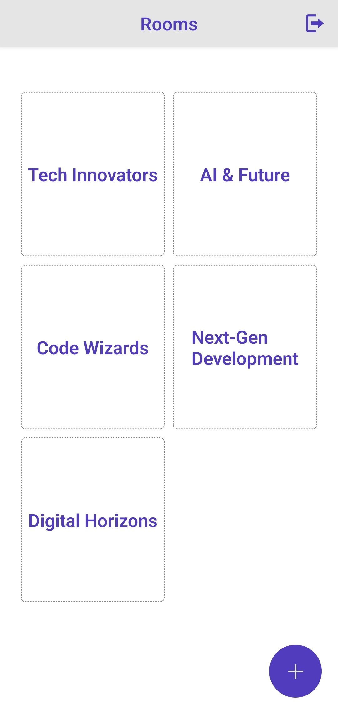
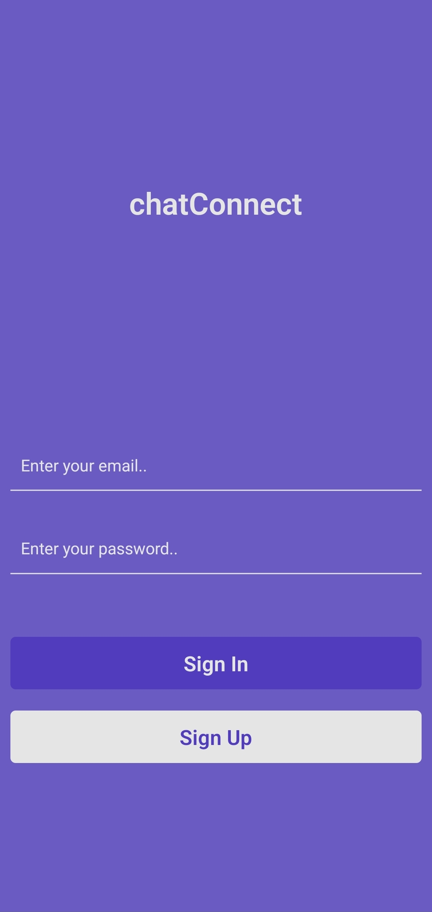
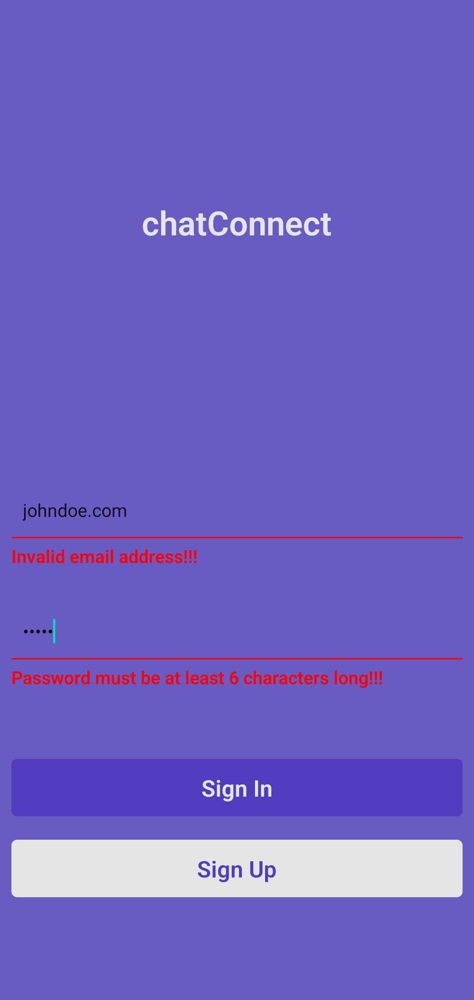
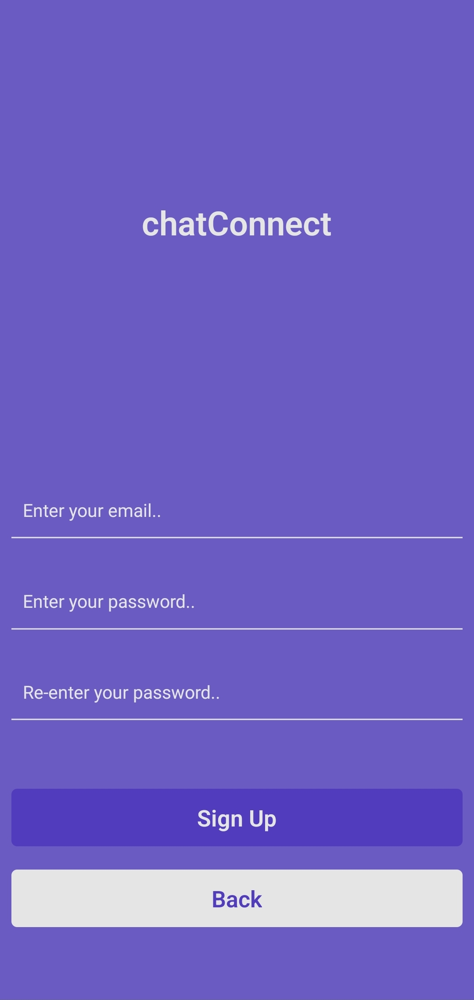

# ChatConnect

ChatConnect is a chat application that allows users to register and log in, create rooms, send messages, and chat with other users. This application provides users with the ability to chat in real-time and is built using Firebase as its backend.

## Features

- **User Registration and Login**: Users can register and log in to the application.
- **Room Creation**: Users can create new chat rooms.
- **Messaging**: Users can send messages in the created rooms and interact with other users.
- **Real-Time Chat**: Provides a real-time messaging experience using Firebase.
- **User-Friendly Interface**: Simple and modern user interface design.

## Technologies

The project is developed using the following technologies:

- **React Native**: The main framework for the mobile application.
- **Firebase**: For real-time database and authentication.
- **Formik & Yup**: For form handling and validation.
- **React Navigation**: For navigating between different screens within the app.
- **React Native Modal**: For modal components.

## Installation

1. Clone the repository:

   ```bash
   git clone https://github.com/bilalseen/ChatConnect.git
   cd job-finder-app

   ```

2. Install dependencies::

   ```bash
   npm install

   ```

3. Start the app:
   ```bash
   npm start
   ```

### Screenshots

<div style="text-align: center;">
  <table style="margin: 0 auto;">
    <tr>
      <th style="text-align: center;">Home</th>
      <th style="text-align: center;">Room Chat Page</th>
      <th style="text-align: center;">SignIn Page</th>
      <th style="text-align: center;">SignIn Warning</th>
      <th style="text-align: center;">SignUp Page</th>
    </tr>
    <tr>
      <td style="text-align: center;">
        
      </td>
      <td style="text-align: center;">
        
      </td>
      <td style="text-align: center;">
        
      </td>
      <td style="text-align: center;">
        
      </td>
      <td style="text-align: center;">
        
      </td>
    </tr>
  </table>
</div>

## API Information

ChatConnect uses Firebase to perform data exchange and authentication processes. The following features are integrated with Firebase:

- Firebase Authentication: Used for user registration and login.
- Firebase Realtime Database: Used for storing real-time messages and room information.

## Folder Structure

```bash
├── assets                  # Images and static files
├── components
│   ├── auth                # Components related to registration and login
│   ├── chat                # Components related to messaging and chat rooms
├── navigation
│   └── Router.js           # In-app page navigation
├── pages                   # Main pages (rooms, details, messages)
├── services
│   └── firebaseConfig.js    # Firebase configuration
├── styles                  # Styles and theme files
├── utils                   # Utility functions and error handling
├── App.js                  # Main application file
└── README.md               # Project description file
```

## How it works

- **User Registration/Login:** Users register and log in using Firebase Authentication.
- **Room Creation:** Users create chat rooms.
- **Messaging:** Users send messages in real-time within the room.
- **Room Details:** Detailed information and past messages for each room are displayed.

## License

This project is licensed under the MIT License - see the LICENSE file for details.
